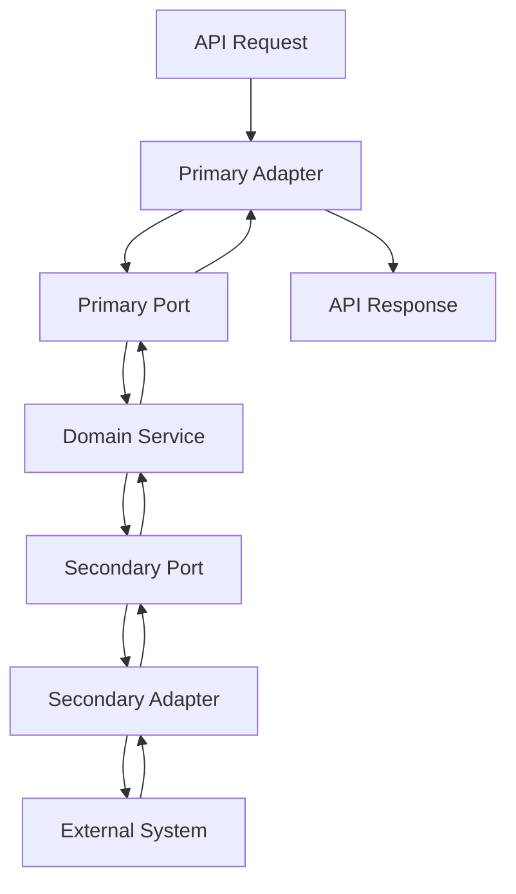

# OEV Feed Architecture

## Project Overview
The OEV Feed project is a DeFi data feed service focused on tracking and monitoring user positions across various DeFi protocols. The system provides real-time position data including collateral, debt, and health factors for DeFi users.

> **Status:** ✅ **Fully Operational** - NestJS application with complete REST API, risk assessment system, and database integration.

### Current Architecture (Hexagonal Architecture)

The project is built as a **Hexagonal (Ports and Adapters) Architecture** with clear boundaries between core business logic and external systems, implemented using **NestJS framework** with **TypeORM** for database operations.

#### Core Benefits of Hexagonal Architecture for OEV Feed

1. **Protocol Independence**
   - Core business logic remains isolated from protocol-specific implementations
   - Adding new protocols requires only implementing adapters, not modifying core logic
   - Protocols can evolve independently without affecting other parts of the system

2. **Provider/Network Flexibility**
   - RPC providers can be easily swapped or extended
   - Network-specific code is isolated in dedicated adapters
   - Multiple networks can be supported for each protocol

3. **Testability**
   - Business logic can be tested without external dependencies
   - Adapters can be mocked for testing core functionality
   - Integration tests focus on adapter implementations

4. **Maintainability**
   - Clear separation of concerns
   - Focused components with single responsibilities
   - Isolated technical debt

## Detailed Architecture Design

### Domain Layer (Inner Hexagon)

The core of the system contains business logic and domain models, independent of external systems.

1. **Domain Models**
   - PositionModel: Protocol-agnostic position representation
   - RiskAssessmentModel: Health factor and risk evaluation
   - UserModel: Core user data structure

2. **Domain Services**
   - PositionService: Business operations on positions
   - RiskAnalysisService: Risk evaluation and alerts
   - PortfolioService: User portfolio management

3. **Domain Utilities**
   - address-utils: Address normalization and validation
   - numeric-utils: Numeric formatting and calculations
   - contract-verification: Smart contract verification utilities

4. **Domain Types**
   - data-source-type: Type definitions for data sources
   - protocol-specific types: Definitions for protocol interactions

5. **Ports (Interfaces)**
   - **Primary Ports** (Inbound):
     - PositionQueryPort: Interface for querying positions
     - PositionCommandPort: Interface for updating positions
     - RiskAssessmentPort: Interface for assessing position risk
   
   - **Secondary Ports** (Outbound):
     - DatabasePort: Interface for all database operations (positions, providers, etc.)
     - PositionRepositoryPort: Interface for position persistence and retrieval
     - ProviderRepositoryPort, ProviderRequestRepositoryPort, ProviderHealthRepositoryPort: Interfaces for provider-related persistence
     - ProtocolAdapterPort: Interface for communicating with protocols
     - NotificationPort: Interface for alerting and notifications

### Application Layer

The application layer coordinates the flow of data between the domain and adapter layers.

1. **Services**
   - QueryOrchestratorService: Coordinates queries across multiple protocols
   - PositionAggregationService: Aggregates position data from different sources

2. **DTOs and Mappers**
   - Data Transfer Objects for API communication
   - Mappers to transform between domain models and DTOs
   - Validation logic for input data

### Adapter Layer (Outer Hexagon)

Adapters implement outbound ports and connect the domain to infrastructure (database, blockchain, etc.).

- **TypeORMAdapter**: Implements DatabasePort for all database operations
- **PositionRepository**: Implements PositionRepositoryPort, used for persisting and retrieving user positions
- **RepositoryFactory**: Provides singleton access to all repositories via their port interfaces

### Infrastructure Layer

The infrastructure layer contains cross-cutting concerns and configuration.

1. **Utilities**
   - provider-health-monitor: Monitoring blockchain provider health (uses NestJS Logger)
   - request-distributor: Intelligent request routing (uses NestJS Logger)
   - data-source-fallback: Data source fallback strategies (uses NestJS Logger)
   - **Path Aliases & Direct Imports**: All imports now use direct path aliases (e.g., `@domain/*`, `@adapters/*`), and barrel files have been removed to improve optimization and clarity.
   - **Legacy Components Removed**: circuit-breaker, metrics-collector, structured-logger, and dashboard-service have been removed in favor of NestJS built-in Logger and simplified implementations.

2. **Configuration**
   - Environment-based configuration
   - Provider configuration
   - Network configuration

### Shared Layer

The shared layer contains utilities and types used across all layers.

1. **Utilities**
   - errors: Error handling utilities
   - retry: Retry functionality
   - exponential-backoff: Retry with exponential backoff

2. **Types**
   - winston.d.ts: Logger type definitions

### Key Architectural Updates (2025)
- All repositories now accessed via their port interfaces for strict hexagonal compliance
- PositionRepository and PositionRepositoryPort added
- RepositoryFactory exposes all repositories via port interfaces
- Domain services (e.g., PositionService) depend only on port interfaces, not implementations
- **Provider Infrastructure**: Provider adapters, provider factory, health monitor, and request distributor are fully implemented for Alchemy and Infura.
- **Logger Refactoring**: Replaced all legacy structured logging and metrics systems with NestJS built-in Logger across all components including protocol adapters, provider adapters, infrastructure utilities, and application services.

### Data Flow Architecture

### Query and Data Management

1. **Query Orchestration**
   - QueryOrchestrator service coordinates across protocols
   - Protocol-specific queries built by adapters
   - Parallel query execution for performance

2. **Data Normalization**
   - Protocol adapters transform data to standard format
   - DTO-based transformation pipeline
   - Common data model across all protocols

3. **Data Persistence**
   - Protocol-agnostic storage
   - Caching for performance optimization
   - Event-based updates

## Implementation Status

### ✅ **Completed & Operational**
   - **NestJS Application**: Fully functional with dependency injection
   - **REST API Controllers**: All endpoints working (positions, providers, events, risk-assessment)
   - **Domain Services**: RiskAnalysisService, ProvidersService, EventsService, PositionsService
   - **Database Integration**: TypeORM with PostgreSQL, all entities configured
   - **Configuration Services**: HttpConfigService, AppConfigService with validation
   - **DTO Mapping**: Entity-to-DTO transformations working
   - **Risk Assessment System**: Complete risk calculation with RiskCalculator utility

### 🔄 **Available for Development**
   - Protocol adapter implementations (Aave V2/V3 adapters exist but need integration)
   - Data fetching from DeFi protocols
   - Database schema population
   - WebSocket real-time updates
   - GraphQL API layer

### 📋 **Planned**
   - Additional protocol adapters (Compound, Curve, Silo)
   - Enhanced caching strategy and performance optimizations
   - Real-time update system and analytics dashboard

## Protocol and Network Roadmap

### Current Implementation
- **Aave V2/V3** on **Ethereum**
- Provider adapters (Alchemy, Infura) with fallback and monitoring

### Near-Term Expansion
- **Aave V2/V3** on **Base**
- **Silo Finance** on **Arbitrum**

### Future Expansion
- Additional protocols (Compound, Curve, etc.)
- Additional networks (Optimism, Polygon, etc.)

## Technical Stack

- **Backend**: TypeScript/Node.js
- **Database**: PostgreSQL with TypeORM
- **Blockchain Interaction**: ethers.js
- **API**: REST and GraphQL
- **Real-time**: WebSocket for live updates
- **Infrastructure**: 
  - Alchemy/Infura for RPC
  - Environment-based configuration
  - NestJS built-in Logger for all logging operations

### TypeORM Benefits

1. **Flexible Query Building**
   - Query Builder pattern for complex queries
   - Support for both Data Mapper and Active Record patterns
   - Raw SQL queries when needed for optimization

2. **Relationship Management**
   - Robust handling of one-to-many, many-to-many relationships
   - Lazy and eager loading options
   - Cascading operations

3. **Transaction Support**
   - Advanced transaction handling
   - Supports nested transactions
   - Transaction isolation levels

4. **Migration System**
   - Automated schema migration generation
   - Migration versioning
   - Safe schema updates

## Future Considerations

1. **Protocol Expansion**
   - Integration with additional DeFi protocols
   - Cross-protocol position aggregation

2. **Performance Optimization**
   - Caching layer implementation
   - Batch processing for multiple positions
   - Response time optimization

3. **UI/Analytics**
   - Position visualization dashboard
   - Risk analytics
   - Historical performance tracking